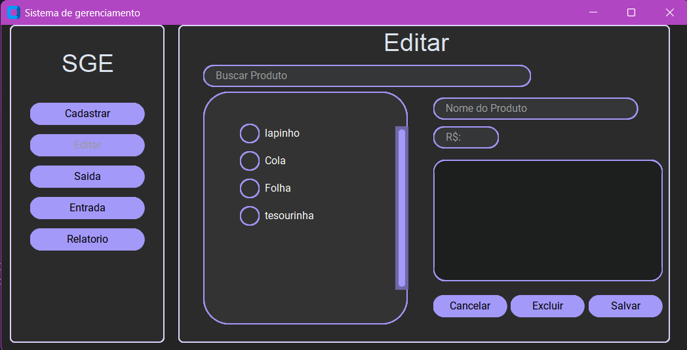
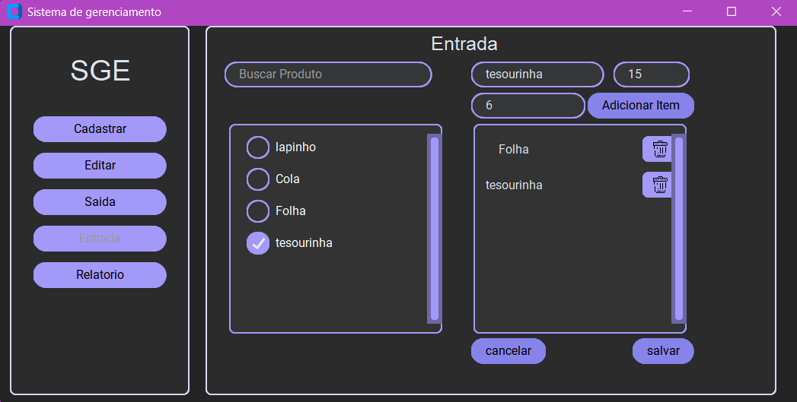

#                                  
 \ PROJETO GENRENCIAMENTO DE ESTOQUE    

  

    
  <a href="app.lofi.co">
    
    <a> Tela Inicial</a>
      
 

   
   
   

  
    

  

 

    
  <a href="app.lofi.co">
    
    <a> Tela Cadastro</a>
      
 

   
   
   

  
    

  

 

  <a href="app.lofi.co">
    <a href="app.lofi.co">    
          

  <a href="app.lofi.co">
    
    <a> Tela Edital</a>
      
 

   
   
   

  
    

  

 

  <a href="app.lofi.co">
    
    <a> Tela Saida</a>
      
 

   
   
   

  
    

  

 

  <a href="app.lofi.co">
    
    <a> Tela Entrada</a>
      
 

   
   
   

  
    

  

 

  <a href="app.lofi.co">
    
    <a> Tela Relatorio</a>
      
 
      

   
   <h3> Tela onde exibe os valores  </h3>
   

  
    

  

 

